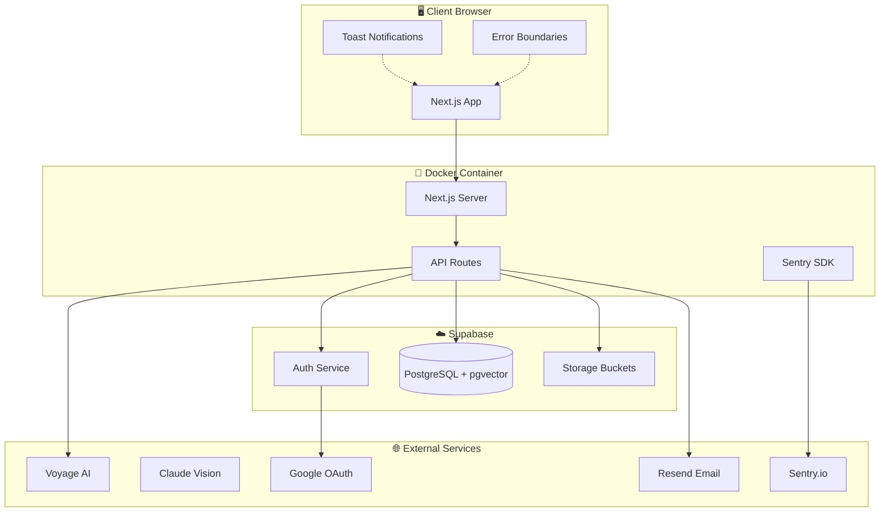
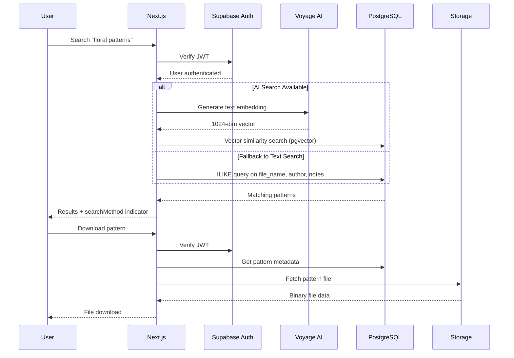
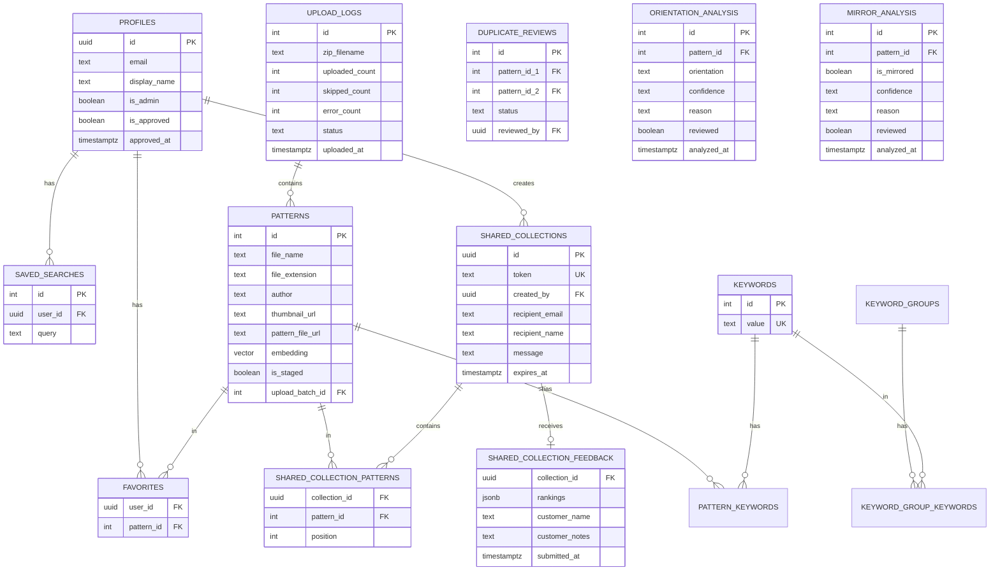

<div align="center">
  

  # Quilting Pattern Manager

  **A modern web app to browse, search, and download quilting patterns**

  [](https://nextjs.org/)
  [](https://www.typescriptlang.org/)
  [](https://supabase.com/)
  [](https://tailwindcss.com/)
  []()

  [Live Demo](https://patterns.tachyonfuture.com) &bull; [Error Handling](docs/ERROR_HANDLING.md)
</div>

---

## Overview

This application replaces the legacy Windows-only **PVM (Pattern Viewer and Manager)** software with a modern, accessible web interface. The original software from 2008 is no longer supported and cannot be reinstalled if the machine fails.

### Key Stats

| Metric | Value |
|--------|-------|
| Total Patterns | 15,651 |
| Keywords | 568 |
| Thumbnails | 15,350 |
| File Types | `.qli`, `.csq`, `.dxf`, `.pat` |

---

## Features

### Pattern Browsing
- Responsive thumbnail grid optimized for all screen sizes
- Infinite scroll pagination (50 patterns per page)
- Filter by keyword, file extension, or author
- Sort by name, author, or date added
- **Pinned Keywords** - Pin up to 10 frequently used keywords for quick access at the top of the sidebar

### AI-Powered Search
- **Natural language search** - Describe what you're looking for (e.g., "butterflies with swirls", "floral border patterns")
- Powered by Voyage AI multimodal embeddings + pgvector
- Automatic fallback to text search if AI service is unavailable

### Pattern Sharing
- **Share with customers** - Select up to 10 patterns and email them to non-member recipients
- **Drag-to-rank feedback** - Customers rank patterns by preference without needing an account
- **Email notifications** - Sender receives email when customer submits rankings
- **Share history** - Track all sent shares and feedback status in account dashboard
- Links expire after 30 days

### Duplicate Detection
- **Visual similarity search** - Find patterns that look alike using AI embeddings
- **Adjustable threshold** - Control how similar patterns need to be (0.90-0.99)
- **Batch review** - Mark pairs as duplicates or not-duplicates
- **Admin tool** - Helps clean up redundant patterns in the library

### Authentication & Security
- Google OAuth + Email/Password via Supabase
- User approval system - new signups require admin approval
- Row-level security (RLS) on all database tables
- Protected pattern downloads
- Admin panel for user management

### AI-Powered Thumbnail Orientation & Mirror Detection
- **Automatic orientation detection** - Claude Vision analyzes all thumbnails to identify incorrectly rotated patterns
- **Mirror detection** - Identifies horizontally mirrored images (like backwards text on military patches)
- **Confidence scoring** - Each detection includes high/medium/low confidence rating
- **Smart review queue** - Only AI-flagged patterns shown for human review (not all 15,000+)
- **Filter tabs** - Switch between rotation issues, mirrored issues, or view all analyzed patterns
- **One-click fixes** - Recommended rotation or flip action displayed with single-click application
- **Flip controls** - Horizontal flip (Flip H) for mirrored text, Vertical flip (Flip V) for upside-down + mirrored
- **Batch processing** - Background scripts process entire library automatically

### Admin Features
- **User Management** - Approve/reject new signups, view approved users with last login
- **Pattern Triage Queue** - Unified workflow for fixing pattern issues:
  - All rotation, mirror, and missing keyword issues in one prioritized list
  - Filter tabs with live counts (All, Rotation, Mirror, No Keywords)
  - Issue badges showing confidence level and type
  - Quick-fix buttons for recommended actions
  - Bulk selection with shift-click range support
  - Keyboard shortcuts for power users (j/k navigate, space select, r rotate, f flip, c mark correct)
  - Patterns automatically leave queue when all issues are resolved
- **Staged Upload Workflow** - Upload patterns to a staging area for review before publishing:
  - Bulk upload patterns from ZIP files to staging
  - Review page with thumbnail grid showing all uploaded patterns
  - Per-pattern keyword assignment - click a pattern to select it, then apply keywords to just that pattern
  - Individual pattern editing - metadata, keywords, and thumbnails
  - Thumbnail controls - rotate, flip, and delete on each pattern
  - Commit to publish patterns or Cancel to delete entire batch
  - **Auto-generated embeddings** - AI search embeddings generated automatically when batch is committed
  - Pending reviews alert on admin dashboard
- **Duplicate Finder** - Identify and manage similar patterns
- **Keyword Management** - Create, rename, merge, and delete keywords with usage statistics
- **Pattern Metadata Editor** - Edit pattern details (name, author, notes), manage keywords, and upload custom thumbnails (resized to 600px for consistent quality)
- **Pattern Analytics** - Dashboard showing downloads, pattern views, searches, user activity, top downloaded patterns, most viewed patterns, popular search queries, and failed searches (queries with zero results in last 90 days)
- **Activity Log** - Complete audit trail of admin actions with filtering by target type, action, and date range
  - Tracks user approvals, pattern changes, keyword management, and more
  - **Undo capability** - Reverse certain actions (keyword renames, user approvals) directly from the log
- **How-To Guide** - Built-in help documentation for non-technical users

### Error Handling
- Comprehensive toast notification system
- React error boundaries for crash recovery
- Automatic retry with exponential backoff
- Sentry integration for production monitoring
- Graceful degradation for external services

---

## Tech Stack

| Layer | Technology |
|-------|------------|
| **Frontend** | Next.js 16 (App Router), React 19, TypeScript |
| **Styling** | Tailwind CSS |
| **Backend** | Supabase (Postgres + Auth + Storage) |
| **AI Search** | Voyage AI multimodal embeddings, pgvector |
| **AI Vision** | Claude (Anthropic) for thumbnail orientation detection |
| **Error Monitoring** | Sentry |
| **Deployment** | Docker, Nginx Proxy Manager |

---

## Architecture



### Request Flow



### Data Model



---

## Quick Start

### Prerequisites

- Node.js 20+
- npm or yarn
- Supabase project (or self-hosted instance)

### Installation

```bash
# Clone the repository
git clone https://github.com/mbuckingham74/quilting-patterns-viewer.git
cd quilting-patterns-viewer

# Install dependencies
cd app
npm install

# Set up environment variables
cp ../.env.example .env.local
# Edit .env.local with your Supabase credentials

# Run development server
npm run dev
```

Open [http://localhost:3000](http://localhost:3000) to see the app.

### Environment Variables

```bash
# Required
NEXT_PUBLIC_SUPABASE_URL=https://your-project.supabase.co
NEXT_PUBLIC_SUPABASE_ANON_KEY=your-anon-key
SUPABASE_SERVICE_ROLE_KEY=your-service-role-key
VOYAGE_API_KEY=your-voyage-api-key
ANTHROPIC_API_KEY=your-anthropic-api-key  # For AI orientation detection

# Optional (Production)
NEXT_PUBLIC_SENTRY_DSN=your-sentry-dsn
RESEND_API_KEY=your-resend-api-key
```

---

## Deployment

### Using the Deploy Script

```bash
# From project root
./scripts/deploy.sh
```

The script handles:
- Building Docker image for linux/amd64
- Passing NEXT_PUBLIC_* build args
- Transferring to production server
- Restarting the container
- Verifying HTTP 200 response

### Manual Docker Build

```bash
docker build \
  --build-arg NEXT_PUBLIC_SUPABASE_URL="$NEXT_PUBLIC_SUPABASE_URL" \
  --build-arg NEXT_PUBLIC_SUPABASE_ANON_KEY="$NEXT_PUBLIC_SUPABASE_ANON_KEY" \
  -t quilting-patterns:latest .
```

---

## Project Structure

```
patterns/
├── app/                        # Next.js application
│   ├── src/
│   │   ├── app/               # App Router pages & API routes
│   │   ├── components/        # React components
│   │   ├── lib/               # Utilities & Supabase clients
│   │   └── hooks/             # Custom React hooks
│   ├── sentry.*.config.ts     # Sentry configuration
│   └── package.json
├── scripts/                    # Migration & deployment scripts
├── docs/                       # Additional documentation
├── Dockerfile
└── docker-compose.yml
```

---

## Database Schema

The app uses Supabase Postgres with the following main tables:

| Table | Description |
|-------|-------------|
| **patterns** | Pattern metadata, file URLs, vector embeddings, and staging status |
| **keywords** | Searchable keyword taxonomy |
| **pattern_keywords** | Many-to-many junction table |
| **profiles** | User profiles with approval status and admin flag |
| **user_favorites** | User's favorited patterns |
| **saved_searches** | User's saved AI search queries |
| **shared_collections** | Pattern shares sent to customers |
| **shared_collection_patterns** | Patterns included in each share |
| **shared_collection_feedback** | Customer rankings and notes |
| **upload_logs** | Upload batch history with staging status |
| **duplicate_reviews** | Admin reviews of similar pattern pairs |
| **orientation_analysis** | AI-detected thumbnail rotation issues |
| **mirror_analysis** | AI-detected horizontally mirrored thumbnails |
| **admin_emails** | Admin notification recipients |
| **download_logs** | Pattern download tracking for analytics |
| **search_logs** | Search query tracking for analytics |
| **view_logs** | Pattern detail page view tracking for analytics |
| **admin_activity_log** | Audit trail of all admin actions with undo support |
| **pinned_keywords** | User's pinned keywords for quick sidebar access (max 10 per user) |

---

## API Endpoints

| Endpoint | Method | Auth | Description |
|----------|--------|------|-------------|
| `/api/search` | POST | Required | AI-powered pattern search |
| `/api/download/[id]` | GET | Required | Download pattern file |
| `/api/favorites` | GET/POST/DELETE | Required | User favorites |
| `/api/saved-searches` | GET/POST/DELETE | Required | Saved search queries |
| `/api/shares` | GET/POST | Required | Create and list pattern shares |
| `/api/shares/[token]` | GET | Public | Get share details by token |
| `/api/shares/[token]/feedback` | POST | Public | Submit customer rankings |
| `/api/admin/upload` | POST | Admin | Upload new patterns (staged by default) |
| `/api/admin/upload-logs` | GET | Admin | List upload batch history |
| `/api/admin/batches/[id]` | GET | Admin | Get batch details with patterns |
| `/api/admin/batches/[id]/commit` | POST | Admin | Commit staged batch (publish patterns) |
| `/api/admin/batches/[id]/cancel` | POST | Admin | Cancel batch (delete all patterns) |
| `/api/admin/batches/[id]/keywords` | POST | Admin | Bulk add/remove keywords from batch |
| `/api/admin/users` | GET | Admin | User management |
| `/api/admin/users/[id]/approve` | POST | Admin | Approve pending user |
| `/api/admin/users/[id]/reject` | POST | Admin | Reject pending user |
| `/api/admin/users/[id]/revoke` | POST | Admin | Revoke approved user access |
| `/api/admin/keywords` | GET/POST | Admin | List keywords with stats / Create keyword |
| `/api/admin/keywords/[id]` | PATCH/DELETE | Admin | Update or delete keyword |
| `/api/admin/keywords/merge` | POST | Admin | Merge two keywords into one |
| `/api/admin/duplicates` | GET | Admin | Find similar patterns |
| `/api/admin/duplicates/review` | POST | Admin | Mark duplicate status |
| `/api/admin/patterns` | GET | Admin | List patterns (paginated) |
| `/api/admin/patterns/[id]` | GET/PATCH | Admin | Get/update pattern metadata |
| `/api/admin/patterns/[id]/keywords` | GET/POST/DELETE | Admin | Manage pattern keywords |
| `/api/admin/patterns/[id]/transform` | POST | Admin | Rotate/flip thumbnail |
| `/api/admin/orientation` | GET/PATCH | Admin | AI orientation detection results |
| `/api/admin/triage` | GET | Admin | Unified triage queue (rotation, mirror, no keywords) |
| `/api/admin/triage/bulk` | PATCH | Admin | Bulk mark reviewed / add keywords |
| `/api/admin/analytics` | GET | Admin | Overview stats (users, downloads, searches, shares) |
| `/api/admin/analytics/activity` | GET | Admin | 30-day activity chart data |
| `/api/admin/analytics/top-patterns` | GET | Admin | Most downloaded patterns |
| `/api/admin/analytics/top-views` | GET | Admin | Most viewed patterns |
| `/api/admin/analytics/top-searches` | GET | Admin | Most popular search queries |
| `/api/admin/analytics/failed-searches` | GET | Admin | Top failed searches (zero results) in last 90 days |
| `/api/admin/patterns/[id]/thumbnail` | POST | Admin | Upload custom thumbnail for a pattern |
| `/api/admin/activity` | GET | Admin | Admin activity audit log with filters |
| `/api/admin/activity/undo` | POST | Admin | Undo a reversible admin action |
| `/api/views` | POST | Required | Log a pattern detail page view |
| `/api/keywords` | GET | Required | List all keywords |
| `/api/pinned-keywords` | GET/POST | Required | Get or pin a keyword |
| `/api/pinned-keywords/[keywordId]` | DELETE | Required | Unpin a keyword |

---

## Error Handling

The app includes a robust error handling system:

```typescript
// Show user-friendly toast notifications
import { useToast } from '@/components/Toast'
const { showError, showSuccess } = useToast()
showError(error, 'Download failed')

// Log errors with Sentry integration
import { logError } from '@/lib/errors'
logError(error, { component: 'PatternGrid', action: 'load' })
```

See [docs/ERROR_HANDLING.md](docs/ERROR_HANDLING.md) for complete documentation.

---

## Contributing

This is a private project built for a specific use case. However, the architecture and patterns used may be helpful for similar applications.

---

## License

Private - All rights reserved.

---

<div align="center">
  <sub>Built with care for Pam and her quilting friends</sub>
</div>
